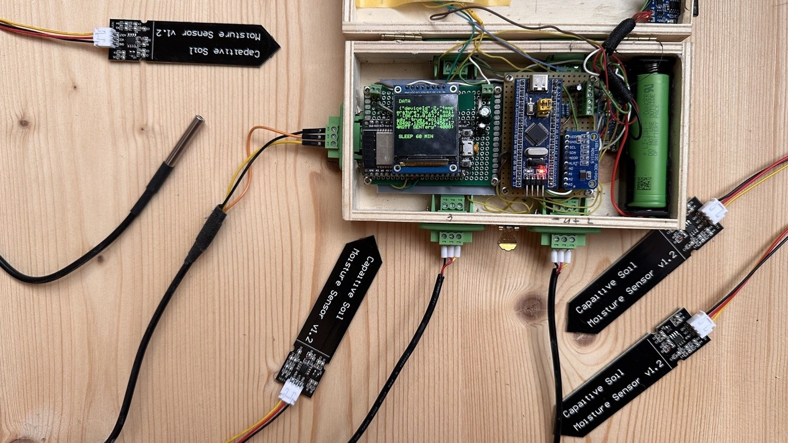
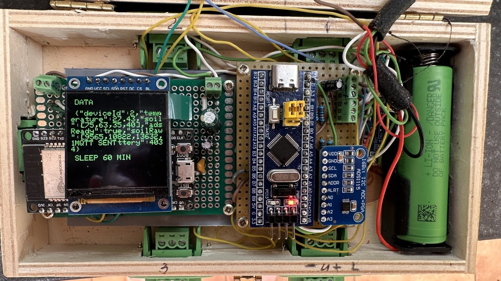

# Smart Garden — Low-Power Embedded IoT Monitoring System

Smart Garden is a real hardware-and-software project for monitoring soil moisture, temperature, and battery status. The system combines an STM32 sensor node, an ESP32 Wi-Fi/MQTT gateway, a Spring Boot backend, PostgreSQL, and a React dashboard.

The current stable hardware implementation uses an **STM32F103 (Blue Pill)**. A migration toward an **STM32L4 + FreeRTOS** architecture is in progress on dedicated feature branches.

## Key Engineering Features

- STM32 firmware in C with STM32 HAL
- External ADS1115 ADC over I2C for four soil-moisture channels
- DS18B20 temperature sensing
- UART protocol between STM32 and ESP32
- ESP32 Wi-Fi + MQTT communication
- Low-power operation: STM32 STOP mode + ESP32 deep sleep
- Wake-up over UART activity and manual wake button
- Battery-voltage monitoring with ADC calibration and protection thresholds
- Diagnostic blink codes for field debugging
- Spring Boot REST backend with PostgreSQL persistence
- React dashboard with history charts and CSV export
- Docker-based deployment and GitHub Actions CI/CD

## Hardware Prototype

Real-hardware photos and a short demo video will be added here.

<!--


-->

## System Architecture

```text
Soil sensors ──► ADS1115 ──I2C──► STM32 ──UART 115200──► ESP32
DS18B20 ────────────────────────►   │                     │
Battery ADC ────────────────────►   │                     │ Wi-Fi / MQTT
                                  │                     ▼
                                  │                 Mosquitto
                                  │                     │
                                  │                     ▼
                                  │                Spring Boot
                                  │                     │
                                  │                 PostgreSQL
                                  │                     │
                                  └──────────────► React dashboard
```

## Repository Structure

| Directory | Stack | Role |
|---|---|---|
| `STM/` | STM32F103, STM32CubeIDE, C/HAL | Stable sensor-node firmware |
| `STM-L467/` | STM32L4 development | Experimental next-generation firmware |
| `ESP/` | ESP32 DOIT DevKit V1, PlatformIO/Arduino | UART-to-Wi-Fi/MQTT gateway |
| `garden-backend/` | Spring Boot 3.5, Java 21, PostgreSQL | MQTT ingestion and REST API |
| `garden-frontend/` | React 18, Vite, Tailwind CSS | Dashboard, charts and administration |
| `mosquitto/` | Eclipse Mosquitto | MQTT broker configuration |

## Measurement Cycle

1. ESP32 wakes from deep sleep after 60 minutes or via the manual button.
2. ESP32 sends `MEASURE\n` over UART.
3. UART activity wakes the STM32 from STOP mode.
4. STM32 reads the ADS1115 soil channels, DS18B20 temperature sensor, and battery voltage.
5. STM32 sends one JSON payload back over UART.
6. ESP32 publishes the payload to MQTT.
7. Spring Boot stores the measurements in PostgreSQL.
8. ESP32 sends an ACK to the STM32.
9. STM32 returns to STOP mode and ESP32 returns to deep sleep.

## MQTT Payload

Topic:

```text
smartgarden/{deviceId}/data
```

Example:

```json
{
  "deviceId": 2,
  "temperature": 24.50,
  "soil": [78, 45, 23, 90],
  "adsReady": true,
  "soilRaw": [8200, 11800, 14100, 7600],
  "battery": 3812
}
```

- `soil` contains calibrated values from 0 to 100%.
- `temperature` is `null` if the DS18B20 read fails.
- `adsReady` indicates whether the ADS1115 responded on I2C.
- `soilRaw` exposes raw ADC values for calibration and diagnostics.
- `battery` is measured in millivolts.

## Embedded Firmware Highlights

### STM32

The STM32 firmware is responsible for deterministic sensor acquisition and low-power control.

Important implementation details:

- interrupt-driven UART receive
- wake-up from STOP mode using the USART RX line
- ADS1115 communication over I2C
- DS18B20 temperature acquisition
- soil-moisture calibration from raw ADC values to percentage
- battery voltage averaging over eight ADC samples
- ADC calibration at startup
- critical-battery protection with STANDBY fallback
- UART reinitialization after STOP-mode wake-up

### ESP32

The ESP32 acts as the communication gateway rather than the primary sensor controller.

Responsibilities:

- wake the STM32 and request a measurement
- receive and validate the JSON payload over UART
- connect to Wi-Fi and MQTT
- publish to `smartgarden/{deviceId}/data`
- send an ACK back to STM32
- provide a small TFT status display
- signal errors using diagnostic LED blink codes
- enter deep sleep between measurement cycles

## Low-Power Design

The system is designed for battery-powered operation.

- **STM32:** STOP mode between measurements
- **ESP32:** deep sleep between measurement cycles
- **Wake interval:** 60 minutes
- **Manual wake:** GPIO33 button on the ESP32
- **Battery monitoring:** ADC1 IN3 through a 100 kΩ / 100 kΩ divider

Battery formula:

```text
mV = raw × 3300 × 2 / 4095
```

Eight ADC samples are averaged. The sampling time is increased to 71.5 cycles because the resistor divider has relatively high source impedance.

Thresholds in the STM32 firmware:

- low battery: `3400 mV`
- critical battery: `3100 mV`
- critical shutdown requires three consecutive low readings

## Hardware Wiring

| Signal | ESP32 pin | STM32 / other side |
|---|---|---|
| UART RX | GPIO16 | PA9 / USART1 TX |
| UART TX | GPIO17 | PA10 / USART1 RX |
| Manual wake button | GPIO33 | button to GND |
| Diagnostic LED | GPIO26 | LED through resistor to GND |
| Common ground | GND | STM32 GND |

STM32 diagnostic LED:

- PC13: onboard LED, active LOW
- PB12: external LED, active HIGH

## Diagnostic Blink Codes

### STM32

| Event | Blinks |
|---|---|
| Measurement cycle started | 1 |
| UART transmit success | 1 |
| UART transmit error | 2 |

### ESP32

| Event | Blinks |
|---|---|
| Wake from deep sleep | 1 |
| MQTT publish success | 1 |
| MQTT publish failure | 2 |
| No valid STM32 JSON received | 3 |

## Backend and Frontend

The backend subscribes to MQTT messages and persists measurements in PostgreSQL. The frontend provides live status, history charts, administration and CSV export.

### REST API

| Method | Path | Description |
|---|---|---|
| GET | `/api/sensors` | List sensors |
| GET | `/api/sensors/{deviceId}/history` | Measurement history |
| GET | `/api/sensors/{deviceId}/latest-temperature` | Recent temperature data |
| PUT | `/api/sensors/{deviceId}` | Update sensor metadata |
| DELETE | `/api/sensors/{deviceId}` | Delete sensor and measurements |

### Frontend Pages

| Page | URL | Description |
|---|---|---|
| Dashboard | `/` | Current sensor cards |
| Sensors | `/sensors` | Sensor list and online/offline state |
| Sensor Detail | `/sensors/:id` | Temperature/moisture charts and CSV export |
| Measurements | `/measurements` | Filterable measurement table and CSV export |
| Admin | `/admin` | Edit and delete sensors |

## Local Development

### Full stack

```bash
docker compose up -d
```

The current compose setup expects an external Docker network named `mimozalab-network`.

### Backend

```bash
cd garden-backend
./mvnw spring-boot:run
```

### Frontend

```bash
cd garden-frontend
cp .env.example .env
npm install
npm run dev
```

### ESP32 firmware

```bash
cd ESP
pio run
pio run -t upload
pio device monitor
```

Wi-Fi and MQTT configuration constants are defined at the top of `ESP/src/main.cpp`. Public repository values are redacted.

### STM32 firmware

Primary IDE: STM32CubeIDE.

```bash
cd STM
make
```

## CI/CD

GitHub Actions builds the software components automatically.

| Workflow | Trigger paths | Action |
|---|---|---|
| `backend-deploy.yml` | `garden-backend/**`, `docker-compose.yml` | Build and deploy backend |
| `frontend-deploy.yml` | `garden-frontend/**` | Build and deploy frontend |
| `esp32-build.yml` | `ESP/**` | Compile ESP32 firmware |
| `stm32-build.yml` | `STM/**` | Compile STM32 firmware |

## Current Development

The stable implementation on `main` uses the STM32F103. Development work toward an STM32L4/FreeRTOS version is kept on feature branches so the working baseline remains reproducible.

Current development branches include:

- `feature/stm32l467-freertos`
- `feature/stm32l476-json`

## Known Engineering Issues / Lessons Learned

- After STOP-mode wake-up, USART must be reinitialized before reliable transmission.
- High-impedance wake lines can pick up noise; removing unnecessary wake wiring and using UART activity is more robust.
- A high-value battery divider requires a longer ADC sampling time.
- A floating ADC input can look like a valid low-battery condition, so sanity limits are required.
- Low-power firmware must always include timeout paths so failed communication cannot leave the device awake indefinitely.

## Next Steps

- complete STM32L4 + FreeRTOS migration
- move runtime configuration out of firmware constants
- add real-hardware photos and wiring overview
- add a short demonstration video
- document measured current consumption in active and sleep states
- add automated host-side tests for payload parsing and protocol edge cases

## Further Reading

Detailed development notes, design decisions and roadmap are available in [`CLAUDE.md`](CLAUDE.md).
